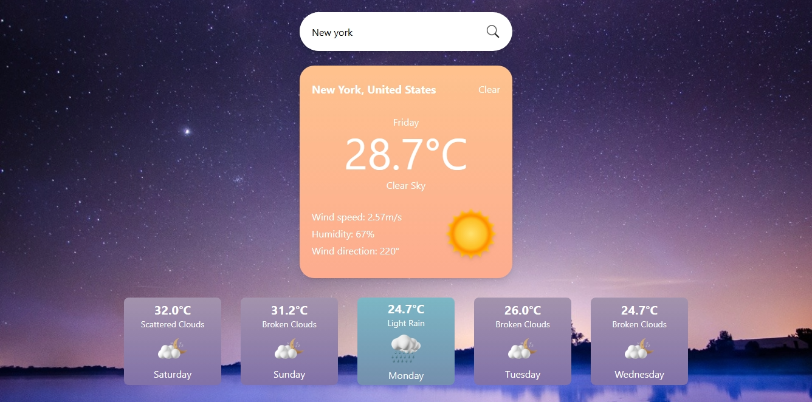

# React Weather Web App

## Description

The React Weather Web App is a simple and intuitive web application that allows users to check the current weather and the 5-day weather forecast for any city worldwide. It leverages the power of React to provide a smooth user interface and real-time weather data from the OpenWeatherMap API.

With this weather app, users can easily stay informed about the weather conditions, plan their outdoor activities, and make travel decisions based on up-to-date weather forecasts. The app displays essential weather information such as temperature, humidity, wind speed, and weather descriptions, providing a comprehensive view of the current and future weather outlook.

## Features

- View current weather conditions for any city.
- Access a 5-day weather forecast to plan ahead.
- Search for weather information for different cities worldwide.
- Responsive design for seamless usage on desktop and mobile devices.

## Technologies

- React: A popular JavaScript library for building user interface
- Fetch API: A promise-based HTTP client to fetch data from the OpenWeatherMap API.
- OpenWeatherMap API: Provides real-time weather data for various locations.

## Installation

To run the React Weather Web App locally, follow these steps:

1. Clone the repository: `git clone https://github.com/ozo-vehe/react-weather-app.git`
2. Navigate to the project directory: `cd react-weather-app`
3. Install dependencies: `npm install`
4. Start the development server: `npm run dev`
5. Open the app in your browser: `http://localhost:3000`

## Contributing

We welcome contributions to improve the React Weather Web App. Feel free to report bugs, suggest features, or submit pull requests. Please refer to the [Contribution Guidelines](CONTRIBUTING.md) for more details.

---
